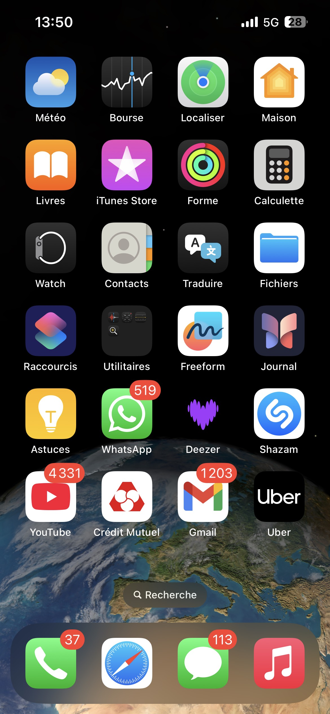

<!DOCTYPE html>
<html lang="fr">
<head>
<meta charset="UTF-8">
<title>iPhone Lock</title>
<meta name="viewport" content="width=device-width, initial-scale=1.0, viewport-fit=cover">
<meta name="apple-mobile-web-app-capable" content="yes">
<meta name="apple-mobile-web-app-status-bar-style" content="black-translucent">

</head>
<body>

    <!-- IMAGE DE TON ÉCRAN DE VERROUILLAGE -->
    

    <!-- ZONES CLIQUABLES pour chaque chiffre sur iPhone 13 -->
    <!-- Ajusté pour clavier standard 1-9 / 0 -->
    

    

    

    

    

    

    

    

    

    

    <!-- ÉCRAN DÉVERROUILLÉ -->
    

        
        

    

</body>
</html>
